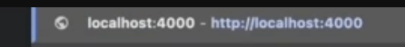

***

### Curso básico de Docker: Desde la instalación hasta el despliegue

#### ¿Qué es Docker?
Docker es una herramienta que permite encapsular aplicaciones y sus dependencias en contenedores, facilitando su despliegue en diferentes sistemas operativos sin problemas de compatibilidad.

***

### Instalación de Docker

- Dirígete a docker.com para descargar la versión adecuada para tu sistema (Apple Silicon, Intel, Windows, Linux).
- Instala Docker Desktop siguiendo las instrucciones de tu sistema.
- Verifica la instalación: abre una terminal y ejecuta el comando `docker version`.

***

### Primeros pasos: Hola Mundo y comandos básicos

- Ejecuta tu primer contenedor con: 
```bash
docker run hello-world
```
- Para trabajar con una imagen de Ubuntu:
```bash
docker run -it ubuntu
```
Esto descargará la imagen y te permitirá interactuar con el sistema operativo Ubuntu dentro de tu contenedor.

- Comprueba tus imágenes locales:
```bash
docker images
```
- Revisa los contenedores activos y detenidos:
```bash
docker ps
docker ps -a
```

***

### Imágenes y Contenedores

- Una **imagen** es la plantilla (el software y las dependencias).
- Un **contenedor** es la instancia ejecutándose de esa imagen.
- Puedes crear múltiples contenedores desde una única imagen.

***

### Creación de una imagen propia con Dockerfile

Ejemplo para una app en Node.js:
1. Programa tu aplicación, por ejemplo `index.js`.
```js
console.log('!Hola desde JavaScript Dokerizado!');
```

2. Crea un archivo `Dockerfile` con:

```dockerfile
FROM node:18
WORKDIR /app
COPY index.js .
CMD ["node", "index.js"]
```
>Catálogo de todas las imagenes de [Docker](https://hub.docker.com/)
https://hub.docker.com/

3. Construye la imagen:
```bash
docker build -t hola-docker-js .
```
4. Ejecuta el contenedor:
```bash
docker run hola-docker-js
```


***

### Dockerfile para aplicaciones completas
MOdifica tu aplicación, `index.js`.
```js
const express = require( 'express');
const app = express ();
app.get('/', (req, res) => res.send('iServidor Express!'));
app. listen (3000, () => console. log ('Servidor en puerto 3000'));
```
- Copia dependencias (`package.json`, `package-lock.json`) y ejecuta `npm install` dentro del Dockerfile para Node.js.
```bash
npm init -y

npm install express

node index.js
```


```
Modifica `Dockerfile` con:

```dockerfile
FROM node:18
WORKDIR /app
COPY package*json .
RUN npm install
COPY index.js .
CMD ["node", "index.js"]
```

```bash
docker build -t app-docker-js .
docker run app-docker.js
```
- Expón el puerto necesario y mapea con tu entorno local:
```dockerfile
EXPOSE 3000
```
```bash
docker run -p 4000:3000 app-docker-js
```
Esta línea mapea el contenedor (3000) a tu computadora (4000).

***

### Composición con Docker Compose

Para aplicaciones con múltiples servicios, usa `docker-compose.yml`:

Ejemplo para Node.js + PostgreSQL:

```yaml
version: '3'
services:
  app:
    build: .
    ports:
      - "4000:3000"
    environment:
      - USER=usuario
      - PASSWORD=clave
      - DB_HOST=db
      - DB_NAME=postgres
      - DB_PORT=5432
    depends_on:
      - db
  db:
    image: postgres
    environment:
      - POSTGRES_PASSWORD=clave
```

Comando para levantar todo:
```bash
docker-compose up --build
```


***

### Volúmenes en Docker

- Los volúmenes permiten persistir datos aunque el contenedor se borre.
- Uso típico:
```bash
docker run -it -v $(pwd)/datos:/app/datos ubuntu bash
```
Esto conecta una carpeta local a la ruta interna de tu contenedor.

- Para ver y administrar volúmenes:
```bash
docker volume ls
docker volume rm <nombre>
```

***

### Limpiar recursos

Comandos útiles:
```bash
docker container prune
docker image prune
docker system prune -a
```
Estos limpian recursos, imágenes y contenedores no utilizados.

***

### Aplicación de escritorio, DockerHub y despliegue a VPS

- Docker Desktop facilita la gestión visual de contenedores, imágenes y volúmenes.
- Puedes subir tus imágenes a DockerHub (`docker login`, `docker tag`, `docker push`).
- Para desplegar en un VPS, Hostinger es recomendado en el tutorial.
  - Sube tus archivos o usa Git/SCP.
  - Instala Docker y Docker Compose en tu VPS.
  - Corre tus servicios y expón el puerto web apropiado (ej. 80).

***

### Resumen de aprendizaje

Aprenderas:
- Instalar Docker
- Ejecutar contenedores básicos y personalizados
- Construir imágenes propias
- Componer servicios con Docker Compose
- Utilizar volúmenes para persistencia
- Limpiar recursos
- Subir imágenes a DockerHub y desplegar apps en servidores VPS


***

### Introducción a Docker

Docker es una herramienta para encapsular aplicaciones y sus dependencias en contenedores, permitiendo que funcionen igual en Windows, MacOS o Linux, sin errores de compatibilidad.

***

### Instalación y Primeros Pasos

- Descarga Docker desde docker.com según tu sistema operativo.
- Instala Docker Desktop y verifica usando el comando `docker version` en la terminal.
- Corre tu primer contenedor con:
  ```
  docker run hello-world
  ```
- Ejecuta una instancia de Ubuntu:
  ```
  docker run -it ubuntu
  ```
- Consulta imágenes y contenedores:
  ```
  docker images
  docker ps
  docker ps -a
  ```


***

### Imágenes y Contenedores

- Las imágenes son plantillas (software + dependencias).
- Un contenedor es una instancia ejecutándose de esa imagen.
- Puedes crear múltiples contenedores desde una sola imagen.

***

### Crear tus propias Imágenes con Dockerfile

Ejemplo sencillo con Node.js:

```dockerfile
FROM node:18
WORKDIR /app
COPY index.js .
CMD ["node", "index.js"]
```
- Construye la imagen:
  ```
  docker build -t hola-docker-js .
  ```
- Ejecuta el contenedor:
  ```
  docker run hola-docker-js
  ```


***

### Aplicaciones Realistas y Exposición de Puertos

- Copia los archivos de dependencias (`package.json`) y ejecuta `npm install`.
- Expón y mapea puertos para acceder desde el navegador:
  ```
  docker run -p 4000:3000 app-docker-js
  ```
- Agrega `EXPOSE 3000` en tu Dockerfile cuando la app usa ese puerto.[1]

***

### Docker Compose: Multi-Servicios

Ejemplo Node.js + PostgreSQL:

```yaml
version: '3'
services:
  app:
    build: .
    ports:
      - "4000:3000"
    environment:
      - USER=usuario
      - PASSWORD=clave
      - DB_HOST=db
      - DB_NAME=postgres
      - DB_PORT=5432
    depends_on:
      - db
  db:
    image: postgres
    environment:
      - POSTGRES_PASSWORD=clave
```
- Levanta todo con:
  ```
  docker-compose up --build
  ```


***

### Volúmenes para persistencia de datos

- Para evitar pérdida de datos agrega un volumen:
  ```
  docker run -it -v $(pwd)/datos:/app/datos ubuntu bash
  ```
- Ver y eliminar volúmenes:
  ```
  docker volume ls
  docker volume rm <nombre>
  ```


***

### Limpieza y gestión avanzada

- Limpia contenedores e imágenes no usados:
  ```
  docker container prune
  docker image prune
  docker system prune -a
  ```


***

### Docker Desktop y DockerHub

- Docker Desktop ofrece una interfaz gráfica amigable para administrar todo.
- Sube imágenes a DockerHub con `docker login`, `docker tag`, `docker push`.
- Despliega en VPS (Hostinger recomendado): copia tus archivos, instala Docker/Compose, ejecuta tus servicios y configura el puerto HTTP estándar (80).

***
